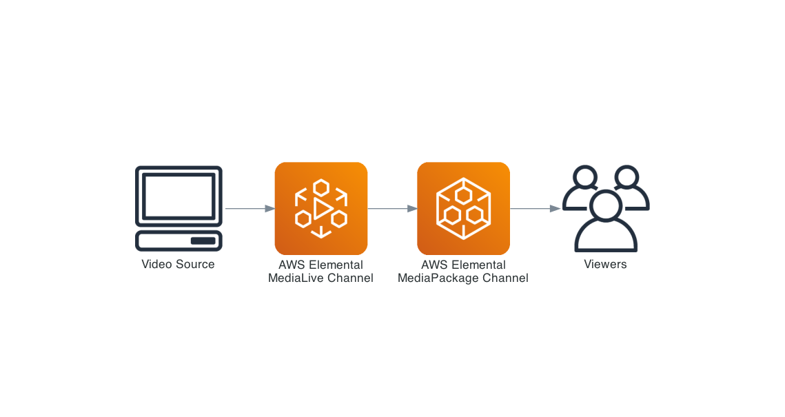
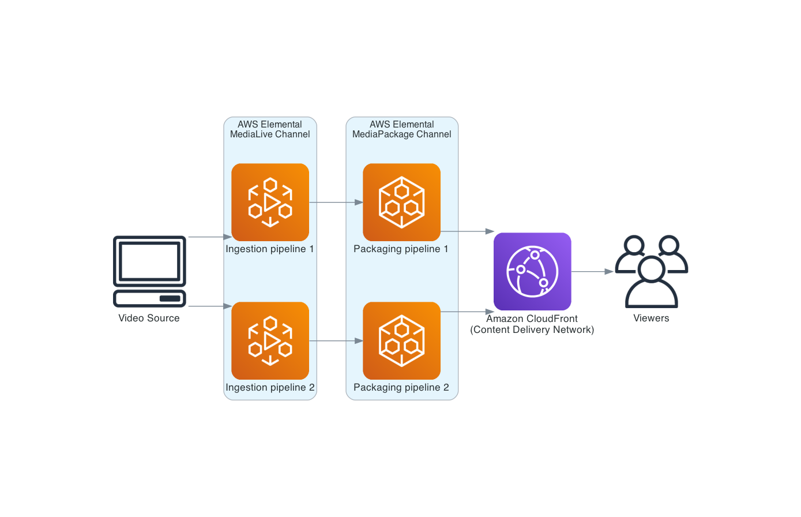

# AWS Elemental Demo

The script here is designed to spin up an example AWS Elemental MediaLive and MediaPackage pipeline to publish a live video stream out to a HLS endpoint in a fully serverless manner. Below is a diagram of what is created by this script. The AWS Elemental services let you get something running with very little in the way off resources that you have to manage. Further down you can see an example architecture of a more production-ready usage of these services.



## Requirements

- AWS CLI with credentials configured
- Python 3.8+
- An RTMP streaming app for your phone (e.g. Zixi OnAir)

## Usage

1. Run `pip install -r requirements.txt` to install the dependencies
2. Run `./DemoPipeline.py` to create a pipeline
3. Copy+paste the m3u8 link for the HLS stream to your browser (Safari works out of the box, others may vary)
   1. Alternatively you can open the MediaPackage console, open the endpoint and click preview in that view
4. Input the RTMP stream values in to a streaming app on your phone or other device. Typically you will put the `/live` in the stream field, and the IP address in the server field of your application
5. When you're finished, run `./DemoPipeline.py --cleanup` to delete all of the resources

## Example

```shell
$ ./DemoPipeline.py
Created MediaPackage channel 'elementalTest_package_channel'
Created HLS origin endpoint with ID: elementalTest_package_origin_endpoint
Created Input Security Group with ID: 2167324
Created RTMP Input with ID: 5945201
Channel still CREATING/UPDATING, wait 2 seconds ...
Channel still CREATING/UPDATING, wait 2 seconds ...
Channel still CREATING/UPDATING, wait 2 seconds ...
Starting Channel with ID: 6517312
Channel 6517312 starting

MediaPackage HLS Endpoint URL: https://761f422bb93edb7b.mediapackage.ap-southeast-2.amazonaws.com/out/v1/2bb20565f8d84eb3ab862102fe1fcb68/index.m3u8
MediaLive Input Paramaters
	 Ip: 13.237.216.152
	 Port: 1935
	 Url: rtmp://13.237.216.152:1935/live
```

## Production Workloads

Here is a more production-ready diagram to show what this would look like. In a production workload you would enable dual-pipelines (think multi-AZ for video streams), and serve customers via CloudFront. Since CloudFront takes ~5 minutes to come up on creation it's left out of this demo pipeline. The dual-pipelines here mean that you can withstand a full AZ failure and continue to run. If you have redundant internet links and recording equipment on-site you can also withstand one of those failing as there are multiple ingestion endpoints created in the MediaLive channel for you to send the video feed to.


